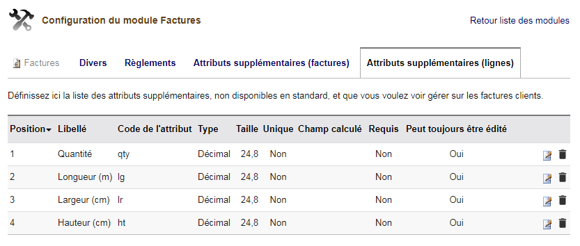

# VOLUME FOR DOLIBARR ERP CRM

## Features
Give the posiblity to automatically calculate the Volume of a product line in Propal/Order/Bill

You need to create 4 extrafields by Propal/Order/Bill line :
- Quantities : qty
- Lenght(m) : lg
- Widht (cm) : lr
- Height (cm) : ht

Other modules are available on <a href="https://www.dolistore.com" target="_new">Dolistore.com</a>.

### Translations

Nothing

Install
-------

### Manually

- Make sure Dolibarr is already installed and configured on your workstation or development server.

- send all the files of the module to htdocs/custom/

### Final steps

From your browser:

  - Log into Dolibarr as a super-administrator
  - Go to "Setup" -> "Modules"
  - You should now be able to find and enable the module

Licenses
--------

### Main code

GPLv3 or any later version.

See [COPYING](COPYING) for more information.

#### Documentation

All texts and readmes.

